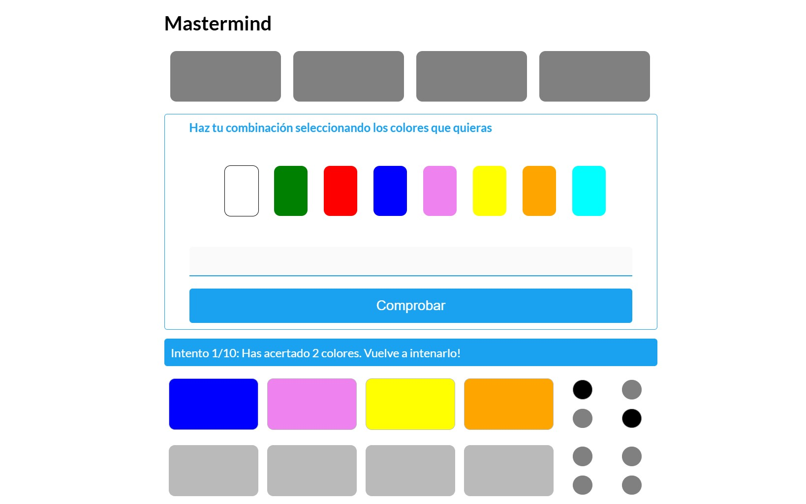
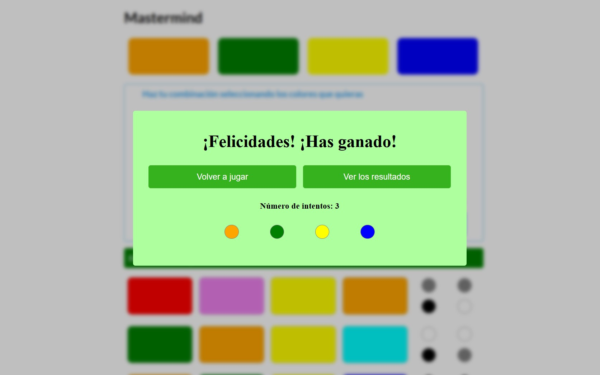

# Mastermind

Este es un proyecto académico desarrollado para la asignatura de **M6 (JavaScript)** del ciclo formativo de **Desarrollo de Aplicaciones Web (DAW)**. El objetivo es crear una versión web del clásico juego **"Mastermind"**, con una interfaz moderna y totalmente interactiva.

---

## Descripción del proyecto

El juego permite a un usuario intentar adivinar una combinación secreta de colores generada aleatoriamente por el sistema. El usuario dispone de **10 intentos** para acertar la combinación, recibiendo pistas visuales tras cada intento:

- 🔴 **Círculo negro**: Color correcto en la posición correcta.  
- ⚪ **Círculo blanco**: Color correcto en la posición incorrecta.  
- ⚫ **Círculo gris**: Color incorrecto.  

La interfaz está desarrollada en **HTML**, **CSS** y **JavaScript moderno (ES6+)**, y es completamente **responsive**.

---

## Funcionalidades principales

- 🎨 Selección visual de colores para formar la combinación.
- ✔️ Comprobación automática de la combinación y generación de pistas.
- ⏳ Límite de intentos configurable.
- 🔔 Ventanas emergentes para indicar victoria o derrota, mostrando la combinación secreta.
- 📱 Interfaz clara, moderna y adaptada a dispositivos móviles.
- ❓ Instrucciones integradas para facilitar el uso.

---

## Tecnologías utilizadas

| Tecnología | Uso |
|------------|-----|
| HTML5 | Estructura de la aplicación |
| CSS3 | Estilos y diseño responsive |
| JavaScript (ES6+) | Lógica del juego e interactividad |

---

## Estructura del proyecto

```
mastermind/
│
├── index.html              # Página principal del juego
├── style.css               # Estilos del juego
├── script.js               # Lógica principal del juego
└── screenshots/            # Imágenes de ejemplo
```

---

## Instrucciones de instalación y uso

### 1. Clonar el repositorio

```bash
git clone https://github.com/tu-usuario/mastermind.git
cd mastermind
```

### 2. Abrir el juego

Abre el archivo `index.html` en tu navegador (puedes hacer doble clic o usar una extensión de servidor local como Live Server en VS Code para una mejor experiencia).

---

## Capturas de pantalla

### Pantalla principal del juego  


### Mensaje de victoria  


---

## Créditos

Proyecto realizado por **Agustí López** para la asignatura de **M6 (JavaScript)** del ciclo **DAW**.

---
